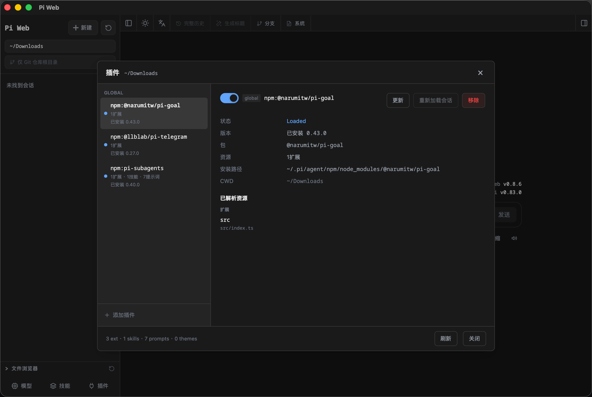

# Pi Web Desktop

<p align="center">
  
</p>

<p align="center">
  A lightweight macOS desktop app wrapper for Pi Web and the Pi coding agent, built with Tauri.
</p>

## Screenshot



## What is Pi Web Desktop?

Pi Web Desktop turns the local Pi Web interface into a native macOS application. Open the app to start Pi Web automatically and use it inside a dedicated WKWebView window—no browser tab or terminal command required.

This repository is intentionally small. It does **not** fork, bundle, or modify Pi Web or Pi. It only provides an application shell that:

- starts the locally installed `@agegr/pi-web` service on `127.0.0.1:30141`;
- displays Pi Web in a native Tauri window;
- restarts the service if it exits unexpectedly;
- cleans up the local service when the app quits;
- writes runtime logs to `~/Library/Logs/pi-web-app.log`.

> [!IMPORTANT]
> This project depends on [agegr/pi-web](https://github.com/agegr/pi-web) and the original [Pi coding agent](https://github.com/earendil-works/pi). Pi was previously hosted at [`badlogic/pi-mono`](https://github.com/badlogic/pi-mono), which redirects to its current repository. This project is an independent desktop wrapper and is not affiliated with the upstream maintainers.

## 中文说明

Pi Web Desktop 是一个轻量的 macOS 应用壳：它自动启动本地安装的 [Pi Web](https://github.com/agegr/pi-web)，并通过 Tauri/WKWebView 将界面装进独立桌面窗口。

本项目没有修改或重新打包 Pi Web 与原版 [Pi](https://github.com/earendil-works/pi)，只增加了启动、窗口、进程看护、退出清理和日志功能。

## Requirements

- macOS on Apple Silicon
- [Node.js](https://nodejs.org/) 22.19.0 or newer
- [Rust](https://www.rust-lang.org/tools/install)
- [Pi Web](https://github.com/agegr/pi-web) installed globally with Homebrew's Node.js

The current launcher expects these Homebrew paths:

```text
/opt/homebrew/bin/node
/opt/homebrew/lib/node_modules/@agegr/pi-web/bin/pi-web.js
```

## Build

Install Pi Web and the desktop wrapper dependencies:

```bash
npm install -g @agegr/pi-web
npm install
```

Build the macOS application:

```bash
npm run build -- --bundles app
```

The app bundle will be created at:

```text
src-tauri/target/release/bundle/macos/Pi Web.app
```

You can open the build directly or copy it to `/Applications`.

## Development

```bash
npm install
npm run dev
```

Pi Web Desktop loads a small startup page while it waits for the local service, then navigates to `http://127.0.0.1:30141`.

## Project structure

```text
frontend/index.html         Startup screen and local service polling
src-tauri/src/main.rs       Pi Web process lifecycle and Tauri app
src-tauri/tauri.conf.json   Window and bundle configuration
src-tauri/icons/            macOS application icons
```

## Troubleshooting

View the application log:

```bash
tail -50 ~/Library/Logs/pi-web-app.log
```

Check whether Pi Web is listening:

```bash
lsof -nP -i:30141 -sTCP:LISTEN
```

Update the upstream Pi Web installation:

```bash
npm update -g @agegr/pi-web
```

## Upstream projects and trademarks

- [Pi Web](https://github.com/agegr/pi-web) provides the local web interface.
- [Pi](https://github.com/earendil-works/pi) provides the coding agent and related tooling.
- All upstream names, logos, and trademarks belong to their respective owners.

## License

The wrapper code in this repository is available under the [ISC License](LICENSE). Pi Web and Pi remain subject to their own licenses.
